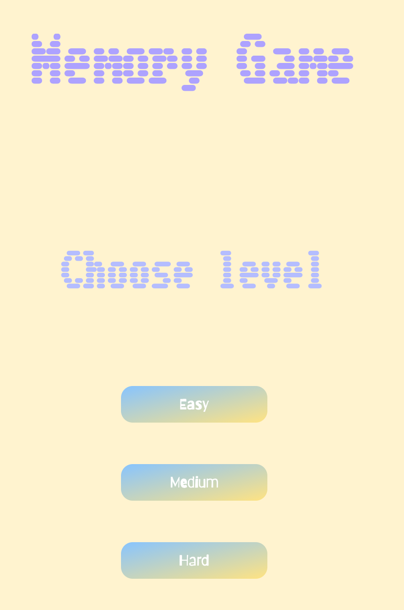

# Memory Game

Welcome to the Memory Game, a classic card-matching game with a modern twist! Challenge your memory and concentration skills as you uncover matching pairs of delightful animal images.

## To Play Game

Here is the game link: https://emmaxzhang.github.io/MemoryGame/

## Screenshots

## Technologies Used

- HTML
- CSS
- JavaScript

## Getting Started

1. Choose your preferred difficulty level: Easy, Medium, or Hard. The card number increase and countdown timer reduce according to different game level.
2. Click on cards to flip them over and reveal the hidden images.
3. Try to find all matching pairs of images by remembering their locations.
4. Cards-left section will remind you how many cards are left on board.
5. Keep track of the countdown timer and aim to find all pairs before time runs out.s
6. Win the game by successfully matching all pairs or lose if the countdown timer reaches zero.

## Features

- Three difficulty levels: Easy (8 cards), Medium (10 cards), and Hard (12 cards).
- Dynamic countdown timer adjusted based on the chosen difficulty level.
- Cards-left tracks how many cards left on board.
- Engaging sound effects and smooth card flipping animation.
- Customizable game experience with the ability to restart and choose different difficulty levels.

## Credits

- Sound effects obtained from [freesound.org](https://freesound.org/)
- Images sourced from [Unsplash](https://unsplash.com/) and [Pixabay](https://pixabay.com/)

## Next Steps

- [ ] Add player lives (player only have 3 chances to play same level)
- [ ] Add number of moves reminder
